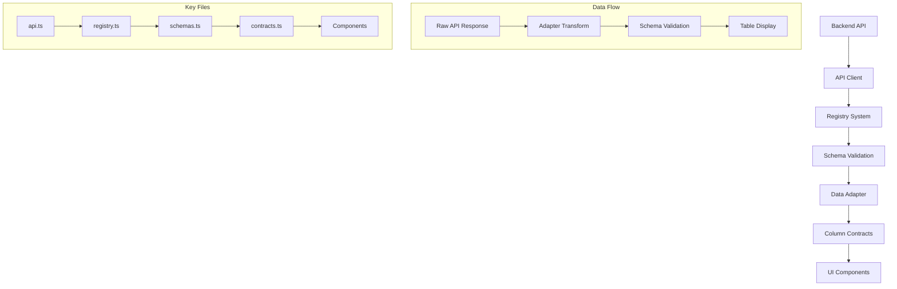

# 📊 **데이터셋 아키텍처 설계서**

## 🎯 **개요**

- **목적**: 부동산부스터 프론트엔드의 데이터셋 구조와 매핑 방식 정의
- **범위**: auction_ed, real_transactions, real_rents 3개 주요 데이터셋
- **작성일**: 2025-08-31
- **최종 업데이트**: 2025-08-31

---

## 🏗 **전체 아키텍처**



---

## 📁 **핵심 파일 구조**

### **1. `/datasets/` 디렉토리**

```
datasets/
├── registry.ts      # 데이터셋 설정 및 API 매핑
├── contracts.ts     # 컬럼 정의 및 테이블 구성
├── schemas.ts       # 데이터 검증 로직
└── normalize.ts     # 필터 정규화
```

### **2. `/lib/` 디렉토리**

```
lib/
├── api.ts          # API 클라이언트
└── adapters/       # 데이터 변환 로직
```

### **3. `/hooks/` 디렉토리**

```
hooks/
├── useDataset.ts   # 데이터셋 상태 관리
└── useColumnOrder.ts # 컬럼 순서 관리
```

---

## 🔧 **데이터셋별 설정**

### **1. Auction_ed (경매결과)**

#### **Registry 설정**

```typescript
auction_ed: {
  id: "auction_ed",
  title: "과거경매결과",
  api: {
    buildListKey: ({ filters, page, size }) => [
      "/api/v1/auction-completed/",
      { ...filters, page, size }
    ],
    fetchList: async ({ filters, page, size }) => {
      // API 호출 및 응답 처리
    }
  },
  table: {
    columns: columnsAuctionEd,  // ⚠️ 중요: 올바른 컬럼 사용
    defaultSort: { key: "saleDate", order: "desc" }
  }
}
```

#### **Schema 검증**

```typescript
// auction_ed는 스키마 검증 완전 우회
if (datasetId === "auction_ed") {
  return row; // 모든 데이터 통과
}
```

#### **컬럼 구성**

- **총 44개 컬럼**: 용도, 사건번호, 현재상태, 매각기일 등
- **위치**: `columnsAuctionEd` in `contracts.ts`

### **2. Real_transactions (실거래가 매매)**

#### **API 응답 매핑**

```typescript
// api.ts에서 응답 포맷 변환
export async function getRealTransactions(params) {
  const response = await fetch(url);
  const data = await response.json();

  return {
    results: data.items, // 백엔드: items → 프론트엔드: results
    count: data.total_items, // 백엔드: total_items → 프론트엔드: count
  };
}
```

#### **컬럼 구성**

- **총 57개 필드**: 계약일자, 거래금액, 전용면적 등
- **위치**: `columnsSale` in `contracts.ts`

### **3. Real_rents (실거래가 전월세)**

#### **데이터셋 특징**

- **총 건수**: 1,397,729건
- **API 매핑**: real_transactions와 동일한 방식
- **컬럼**: 보증금, 월세, 계약기간 등

---

## ⚙️ **데이터 플로우**

### **1. API 호출 단계**

```typescript
// 1. Registry에서 API 정보 가져오기
const config = registry[datasetId];
const [url, params] = config.api.buildListKey({ filters, page, size });

// 2. API 클라이언트에서 호출
const response = await fetch(url, { params });

// 3. 응답 데이터 변환 (필요시)
const transformedData = config.adapter.toItemLike(response.data);
```

### **2. 데이터 검증 단계**

```typescript
// schemas.ts에서 검증
function validateRow(datasetId, row) {
  // auction_ed는 검증 우회
  if (datasetId === "auction_ed") return row;

  // 다른 데이터셋은 스키마 검증 수행
  return validateSchema(row);
}
```

### **3. 테이블 렌더링 단계**

```typescript
// 컬럼 정의에 따라 테이블 구성
const columns = registry[datasetId].table.columns;

// getValueForKey로 데이터 접근
function getValueForKey(row, key) {
  return row?.[key] || row?.extra?.[key] || "-";
}
```

---

## 🚨 **중요 주의사항**

### **1. 컬럼 매핑 오류 방지**

```typescript
// ❌ 잘못된 예시
auction_ed: {
  table: {
    columns: columnsSale; // 실거래가용 컬럼 사용 - 오류!
  }
}

// ✅ 올바른 예시
auction_ed: {
  table: {
    columns: columnsAuctionEd; // 경매결과용 컬럼 사용
  }
}
```

### **2. API 응답 포맷 불일치**

```typescript
// 백엔드 응답 포맷 확인 필수
const backendResponse = {
  items: [...],        // 또는 results
  total_items: 1000    // 또는 count
};

// 프론트엔드 기대 포맷
const frontendFormat = {
  results: [...],
  count: 1000
};
```

### **3. 스키마 검증 우회 설정**

```typescript
// 대용량 데이터나 복잡한 구조의 경우
if (datasetId === "특정_데이터셋") {
  return row; // 검증 우회
}
```

---

## 📋 **새 데이터셋 추가 체크리스트**

### **1. Registry 설정 (`datasets/registry.ts`)**

- [ ] 데이터셋 ID 정의
- [ ] API 엔드포인트 설정
- [ ] buildListKey 함수 구현
- [ ] fetchList 함수 구현
- [ ] adapter.toItemLike 구현 (필요시)
- [ ] 올바른 컬럼 정의 연결

### **2. 컬럼 정의 (`datasets/contracts.ts`)**

- [ ] 새 컬럼 배열 정의 (예: `columnsNewDataset`)
- [ ] 각 컬럼별 key, header, width 설정
- [ ] 정렬 가능 여부 설정

### **3. 스키마 검증 (`datasets/schemas.ts`)**

- [ ] 검증 로직 필요 여부 결정
- [ ] 필요시 검증 함수 구현
- [ ] 불필요시 우회 로직 추가

### **4. API 클라이언트 (`lib/api.ts`)**

- [ ] API 함수 추가 (예: `getNewDataset`)
- [ ] 응답 포맷 변환 로직 구현
- [ ] 에러 처리 로직 추가

### **5. 컴포넌트 연결**

- [ ] 필터 컴포넌트 생성
- [ ] 검색결과 컴포넌트 생성
- [ ] 메인 페이지에 탭 추가

---

## 🔍 **디버깅 가이드**

### **1. 데이터 표시 안됨 ("-" 표시)**

```typescript
// 1. API 응답 확인
console.log("API Response:", data);
console.log("Field Count:", Object.keys(data.items[0]).length);

// 2. 컬럼 매핑 확인
console.log("Column Config:", registry[datasetId].table.columns);

// 3. getValueForKey 동작 확인
console.log("Value for key:", getValueForKey(row, key));
```

### **2. API 호출 안됨**

```typescript
// 1. Registry 설정 확인
console.log("Registry Config:", registry[datasetId]);

// 2. API URL 확인
const [url, params] = registry[datasetId].api.buildListKey(filters);
console.log("API URL:", url, "Params:", params);
```

### **3. 스키마 검증 실패**

```typescript
// 1. 검증 로직 확인
console.log("Schema Validation for:", datasetId);

// 2. 우회 필요시 추가
if (datasetId === "문제_데이터셋") {
  console.log("✅ Schema validation bypassed");
  return row;
}
```

---

## 📈 **성능 최적화**

### **1. 대용량 데이터 처리**

- **가상화된 테이블** 사용 권장
- **페이지네이션** 필수 구현
- **컬럼 선택적 로딩** 고려

### **2. API 호출 최적화**

- **debounce** 적용으로 과도한 호출 방지
- **캐싱 전략** 수립
- **에러 재시도** 로직 구현

### **3. 렌더링 최적화**

- **React.memo** 사용
- **useMemo, useCallback** 적극 활용
- **코드 스플리팅** 적용

---

## 🛡 **보안 고려사항**

### **1. API 보안**

- **인증 토큰** 적절한 관리
- **CORS 설정** 확인
- **민감 정보** 로깅 방지

### **2. 데이터 검증**

- **XSS 방지**를 위한 데이터 sanitization
- **SQL Injection** 방지 (백엔드 협력)
- **데이터 타입** 검증 강화

---

## 📚 **참고 문서**

- [트러블슈팅 가이드](./troubleshooting/데이터셋_문제해결_가이드.md)
- [API 개발 가이드](./Guides/API_DEVELOPMENT_GUIDE.md)
- [컴포넌트 개발 가이드](./Guides/COMPONENT_DEVELOPMENT_GUIDE.md)

---

**작성자**: Frontend Development Team  
**승인자**: Tech Lead  
**버전**: 1.0  
**다음 리뷰**: 2025-09-30
