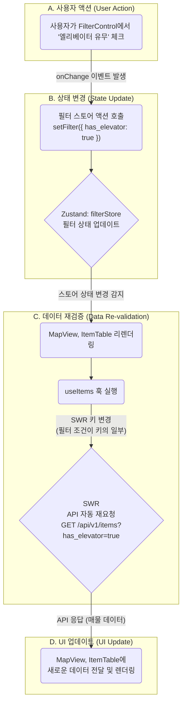

# Booster 프론트엔드 아키텍처 (v1.0)

## 1. 개요 (Overview)

### 1-1. 문서의 목표

이 문서는 Booster 프론트엔드 애플리케이션의 아키텍처를 정의하고, 기술적 의사결정의 배경과 기준을 공유하는 것을 목표로 합니다. 단순한 기술 목록을 넘어, **"왜 이 기술을 선택했고, 어떻게 조합하여 우리의 비즈니스 목표(PRD)를 달성할 것인가?"** 에 대한 명확한 청사진을 제시합니다.

이 문서는 새로운 팀원이 빠르게 프로젝트 구조를 파악하고, 기존 팀원들이 일관된 패턴으로 개발하며, 타 팀(백엔드, 인프라)이 프론트엔드를 이해하는 데 사용되는 **'살아있는 가이드'** 입니다.

### 1-2. 아키텍처 목표

우리가 지향하는 프론트엔드 아키텍처의 핵심 목표는 다음과 같습니다.

- **유지보수성 (Maintainability):** 코드는 예측 가능하고 쉽게 이해하고 수정할 수 있어야 합니다. 각 컴포넌트와 모듈은 명확한 단일 책임을 가져야 합니다.
- **확장성 (Scalability):** 새로운 기능이나 페이지가 추가될 때, 기존 아키텍처를 크게 변경하지 않고도 유연하게 확장할 수 있어야 합니다.
- **개발자 경험 (Developer Experience):** 명확한 구조와 규칙을 제공하여 개발자가 기능 구현 자체에 집중하고, 생산성을 극대화할 수 있는 환경을 제공합니다.

---

## 2. 핵심 기술 스택 및 선정 이유

| 역할            | 기술                     | 선정 이유 (Why?)                                                                                                                                                                                                        |
| :-------------- | :----------------------- | :---------------------------------------------------------------------------------------------------------------------------------------------------------------------------------------------------------------------- |
| **프레임워크**  | **Next.js (App Router)** | 서버 사이드 렌더링(SSR)과 정적 사이트 생성(SSG)을 지원하여 **초기 로딩 성능(FCP)과 검색 엔진 최적화(SEO)를 극대화**합니다. 파일 시스템 기반 라우팅은 직관적이고 관리가 용이합니다.                                      |
| **상태 관리**   | **Zustand**              | Redux의 복잡성과 보일러플레이트 없이, **간결하고 직관적인 API**로 전역 상태를 관리합니다. 특히 여러 컴포넌트에 걸쳐 공유되는 복잡한 필터 상태를 효율적으로 처리하는 데 적합합니다.                                      |
| **데이터 통신** | **SWR**                  | Next.js 개발사 Vercel이 직접 만든 라이브러리로 호환성이 뛰어납니다. **캐싱, 자동 재검증, 포커스 추적** 등 API 데이터를 항상 최신 상태로 유지하는 강력한 기능을 내장하여 개발 생산성을 높입니다.                         |
| **UI 컴포넌트** | **shadcn/ui & Radix UI** | 미리 디자인된 컴포넌트가 아닌, **재사용성과 접근성이 높은 코드 조각**을 제공하여 디자인 시스템을 밑바닥부터 완전하게 제어할 수 있습니다. Radix UI를 기반으로 하여 키보드 네비게이션 등 웹 접근성을 기본으로 보장합니다. |
| **스타일링**    | **Tailwind CSS**         | 유틸리티-우선(Utility-First) 접근법을 통해, 별도의 CSS 파일을 작성하지 않고 HTML 내에서 직접 스타일을 적용하여 **빠른 개발 속도와 일관된 디자인 시스템** 구축을 가능하게 합니다.                                        |

---

## 3. 디렉토리 구조 및 역할

프로젝트는 역할에 따라 명확하게 분리된 폴더 구조를 따릅니다.

```
/Application
|-- /app                 # Next.js의 App Router. 페이지 및 레이아웃
|-- /components          # 재사용 가능한 UI 컴포넌트
|   |-- /ui              # (Atoms) 버튼, 인풋 등 가장 작은 단위의 기초 블록 (shadcn/ui)
|   |-- /features        # (Organisms) 특정 기능(분석, 계산기 등)을 위한 조합 컴포넌트
|   |-- /layout          # (Templates) 헤더, 사이드 패널 등 뼈대 컴포넌트
|-- /hooks               # 커스텀 React Hooks (예: useMobile, useItems)
|-- /lib                 # 외부 라이브러리 설정, 유틸리티 함수 (예: utils.ts)
|-- /services            # API 요청을 처리하는 함수들 (SWR 훅에서 사용)
|-- /store               # Zustand 전역 상태 관리 스토어 (예: filterStore.ts)
|-- /styles              # 전역 CSS 파일 (globals.css)
```

---

## 4. 아키텍처 패턴 및 데이터 흐름

### 4-1. 상태 관리 전략

Booster 프론트엔드는 데이터의 성격에 따라 3가지 종류의 상태를 명확히 구분하여 관리합니다.

| 상태 종류        | 관리 도구      | 관리 대상 데이터 예시                                                                  | 설명                                                                                           |
| :--------------- | :------------- | :------------------------------------------------------------------------------------- | :--------------------------------------------------------------------------------------------- |
| **서버 상태**    | **SWR**        | - 매물 목록<br>- 사용자 정보<br>- 구독 플랜 정보                                       | 백엔드 API로부터 받아온 모든 데이터. SWR이 캐싱, 재검증, 로딩/에러 상태를 자동으로 관리합니다. |
| **전역 UI 상태** | **Zustand**    | - 통합 분석 화면의 필터 조건<br>- 사이드바 열림/닫힘 여부<br>- 수익률 계산기의 입력 값 | 여러 컴포넌트에서 공유되지만, 서버에 저장되지 않는 순수 UI 상태.                               |
| **지역 상태**    | **`useState`** | - Input 컴포넌트의 입력 값<br>- 모달의 열림/닫힘 여부                                  | 특정 단일 컴포넌트 내에서만 사용되는 임시 상태.                                                |

### 4-2. 데이터 흐름 다이어그램 (통합 분석 화면)

사용자가 필터를 변경했을 때의 데이터 흐름은 다음과 같습니다.



---

## 5. 주요 기능 구현 전략

### 5-1. 통합 분석 화면

- **핵심 전략:** 컴포넌트의 완벽한 분리.
- `FilterControl` 컴포넌트는 오직 **Zustand 스토어의 상태를 변경하는 역할**만 수행합니다.
- `MapView`와 `ItemTable` 컴포넌트는 **Zustand 스토어의 상태를 구독**하고, 그 상태를 기반으로 각자 `useItems` 훅을 통해 필요한 데이터를 SWR로 가져와 렌더링합니다.
- 이 구조를 통해 각 컴포넌트는 서로를 전혀 알지 못하며, 오직 중앙 상태 저장소(Zustand)를 통해 통신하여 강력한 디커플링을 유지합니다.

### 5-2. 상세 분석 화면

- **핵심 전략:** 동적 라우팅과 조건부 데이터 로딩.
- Next.js의 동적 라우팅 (`/app/analysis/[id]/page.tsx`)을 사용하여 특정 매물의 상세 페이지를 구현합니다.
- 페이지 진입 시, `SWR`을 사용하여 해당 매물의 기본 정보(`GET /api/v1/items/{item_id}`)만 우선 로드하여 사용자에게 빠르게 화면을 보여줍니다.
- `AnalysisTabs` 컴포넌트에서 사용자가 특정 탭(예: '실거래가(매매)')을 클릭하면, 해당 탭에 필요한 비교 데이터(`GET /api/v1/items/{item_id}/comparables?data_type=trade_sale`)를 `SWR`로 **그 시점에 로드**합니다. 이를 통해 초기 로딩 시간을 단축하고 불필요한 API 호출을 방지합니다.

---

## 6. 코딩 컨벤션 및 품질 관리

### 6-1. 네이밍 컨벤션

| 종류         | 규칙              | 예시                                 |
| :----------- | :---------------- | :----------------------------------- |
| **컴포넌트** | PascalCase        | `FilterControl.tsx`, `ItemTable.tsx` |
| **Hooks**    | `use` 접두사      | `useMobile.ts`, `useItems.ts`        |
| **Store**    | `...Store` 접미사 | `filterStore.ts`, `authStore.ts`     |
| **Types**    | PascalCase        | `interface ItemProps { ... }`        |

### 6-2. Pull Request (PR) 템플릿

모든 PR은 아래 템플릿을 사용하여 작성하여, 코드 리뷰어가 변경 사항을 쉽게 이해할 수 있도록 합니다.

```markdown
## 🧐 PR의 목적이 무엇인가요?

- (e.g., 통합 분석 화면의 필터링 기능 추가)

## 📝 주요 변경 사항은 무엇인가요?

- (e.g., Zustand를 이용한 필터 스토어 생성)
- (e.g., useItems 훅에 필터 로직 연동)

## 🖼️ 스크린샷 (선택 사항)

- (UI 변경이 있을 경우, 변경 전후 스크린샷 첨부)

## ✅ 체크리스트

- [ ] self-review를 진행했나요?
- [ ] 관련 문서를 업데이트했나요?
```

### 6-3. 반드시 피해야 할 패턴 (Anti-patterns)

- **Prop Drilling:** 2-depth 이상의 prop 전달은 피하고, Zustand나 컴포넌트 조합(Composition)으로 해결합니다.
- **거대 컴포넌트 (God Component):** 하나의 컴포넌트가 너무 많은 역할을 하도록 만들지 않습니다. 최대한 작은 단위로 분리하고 각자 단일 책임 원칙을 지키도록 합니다.
- **UI 컴포넌트 내 비즈니스 로직:** API 호출, 데이터 가공 등의 로직은 컴포넌트가 아닌 커스텀 훅(`use...`)이나 서비스 함수(`services/...`)로 분리합니다.
