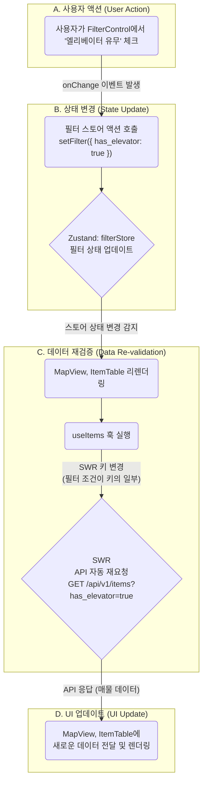

# Booster 프론트엔드 아키텍처 (v1.0)

## 1. 개요 (Overview)

### 1-1. 문서의 목표

이 문서는 Booster 프론트엔드 애플리케이션의 아키텍처를 정의하고, 기술적 의사결정의 배경과 기준을 공유하는 것을 목표로 합니다. 단순한 기술 목록을 넘어, **"왜 이 기술을 선택했고, 어떻게 조합하여 우리의 비즈니스 목표(PRD)를 달성할 것인가?"** 에 대한 명확한 청사진을 제시합니다.

이 문서는 새로운 팀원이 빠르게 프로젝트 구조를 파악하고, 기존 팀원들이 일관된 패턴으로 개발하며, 타 팀(백엔드, 인프라)이 프론트엔드를 이해하는 데 사용되는 **'살아있는 가이드'** 입니다.

### 1-2. 아키텍처 목표

우리가 지향하는 프론트엔드 아키텍처의 핵심 목표는 다음과 같습니다.

- **유지보수성 (Maintainability):** 코드는 예측 가능하고 쉽게 이해하고 수정할 수 있어야 합니다. 각 컴포넌트와 모듈은 명확한 단일 책임을 가져야 합니다.
- **확장성 (Scalability):** 새로운 기능이나 페이지가 추가될 때, 기존 아키텍처를 크게 변경하지 않고도 유연하게 확장할 수 있어야 합니다.
- **개발자 경험 (Developer Experience):** 명확한 구조와 규칙을 제공하여 개발자가 기능 구현 자체에 집중하고, 생산성을 극대화할 수 있는 환경을 제공합니다.

---

## 2. 핵심 기술 스택 및 선정 이유

| 역할            | 기술                     | 선정 이유 (Why?)                                                                                                                                                                                                        |
| :-------------- | :----------------------- | :---------------------------------------------------------------------------------------------------------------------------------------------------------------------------------------------------------------------- |
| **프레임워크**  | **Next.js (App Router)** | 서버 사이드 렌더링(SSR)과 정적 사이트 생성(SSG)을 지원하여 **초기 로딩 성능(FCP)과 검색 엔진 최적화(SEO)를 극대화**합니다. 파일 시스템 기반 라우팅은 직관적이고 관리가 용이합니다.                                      |
| **상태 관리**   | **Zustand**              | Redux의 복잡성과 보일러플레이트 없이, **간결하고 직관적인 API**로 전역 상태를 관리합니다. 특히 여러 컴포넌트에 걸쳐 공유되는 복잡한 필터 상태를 효율적으로 처리하는 데 적합합니다.                                      |
| **데이터 통신** | **SWR**                  | Next.js 개발사 Vercel이 직접 만든 라이브러리로 호환성이 뛰어납니다. **캐싱, 자동 재검증, 포커스 추적** 등 API 데이터를 항상 최신 상태로 유지하는 강력한 기능을 내장하여 개발 생산성을 높입니다.                         |
| **UI 컴포넌트** | **shadcn/ui & Radix UI** | 미리 디자인된 컴포넌트가 아닌, **재사용성과 접근성이 높은 코드 조각**을 제공하여 디자인 시스템을 밑바닥부터 완전하게 제어할 수 있습니다. Radix UI를 기반으로 하여 키보드 네비게이션 등 웹 접근성을 기본으로 보장합니다. |
| **스타일링**    | **Tailwind CSS**         | 유틸리티-우선(Utility-First) 접근법을 통해, 별도의 CSS 파일을 작성하지 않고 HTML 내에서 직접 스타일을 적용하여 **빠른 개발 속도와 일관된 디자인 시스템** 구축을 가능하게 합니다.                                        |

---

## 3. 디렉토리 구조 및 역할

프로젝트는 역할에 따라 명확하게 분리된 폴더 구조를 따릅니다.

```
/Application
|-- /app                 # Next.js의 App Router. 페이지 및 레이아웃
|-- /components          # 재사용 가능한 UI 컴포넌트
|   |-- /ui              # (Atoms) 버튼, 인풋 등 가장 작은 단위의 기초 블록 (shadcn/ui)
|   |-- /features        # (Organisms) 특정 기능(분석, 계산기 등)을 위한 조합 컴포넌트
|   |-- /layout          # (Templates) 헤더, 사이드 패널 등 뼈대 컴포넌트
|-- /hooks               # 커스텀 React Hooks (예: useMobile, useItems)
|-- /lib                 # API 클라이언트, 유틸리티 함수 (22개 API 엔드포인트, utils.ts)
|-- /store               # Zustand 전역 상태 관리 스토어 (예: filterStore.ts)
|-- /styles              # 전역 CSS 파일 (globals.css)
```

---

## 4. 아키텍처 패턴 및 데이터 흐름

### 4-1. 상태 관리 전략

Booster 프론트엔드는 데이터의 성격에 따라 3가지 종류의 상태를 명확히 구분하여 관리합니다.

| 상태 종류        | 관리 도구      | 관리 대상 데이터 예시                                                                  | 설명                                                                                           |
| :--------------- | :------------- | :------------------------------------------------------------------------------------- | :--------------------------------------------------------------------------------------------- |
| **서버 상태**    | **SWR**        | - 매물 목록<br>- 사용자 정보<br>- 구독 플랜 정보                                       | 백엔드 API로부터 받아온 모든 데이터. SWR이 캐싱, 재검증, 로딩/에러 상태를 자동으로 관리합니다. |
| **전역 UI 상태** | **Zustand**    | - 통합 분석 화면의 필터 조건<br>- 사이드바 열림/닫힘 여부<br>- 수익률 계산기의 입력 값 | 여러 컴포넌트에서 공유되지만, 서버에 저장되지 않는 순수 UI 상태.                               |
| **지역 상태**    | **`useState`** | - Input 컴포넌트의 입력 값<br>- 모달의 열림/닫힘 여부                                  | 특정 단일 컴포넌트 내에서만 사용되는 임시 상태.                                                |

### 4-2. 데이터 흐름 다이어그램 (통합 분석 화면)

사용자가 필터를 변경했을 때의 데이터 흐름은 다음과 같습니다.



---

## 5. 주요 기능 구현 전략

### 5-1. 통합 분석 화면

- **핵심 전략:** 컴포넌트의 완벽한 분리.
- `FilterControl` 컴포넌트는 오직 **Zustand 스토어의 상태를 변경하는 역할**만 수행합니다.
- `MapView`와 `ItemTable` 컴포넌트는 **Zustand 스토어의 상태를 구독**하고, 그 상태를 기반으로 각자 `useItems` 훅을 통해 필요한 데이터를 SWR로 가져와 렌더링합니다.
- 이 구조를 통해 각 컴포넌트는 서로를 전혀 알지 못하며, 오직 중앙 상태 저장소(Zustand)를 통해 통신하여 강력한 디커플링을 유지합니다.

### 5-2. 상세 분석 화면

- **핵심 전략:** 동적 라우팅과 조건부 데이터 로딩.
- Next.js의 동적 라우팅 (`/app/analysis/[id]/page.tsx`)을 사용하여 특정 매물의 상세 페이지를 구현합니다.
- 페이지 진입 시, `SWR`을 사용하여 해당 매물의 기본 정보(`GET /api/v1/items/{item_id}`)만 우선 로드하여 사용자에게 빠르게 화면을 보여줍니다.
- `AnalysisTabs` 컴포넌트에서 사용자가 특정 탭(예: '실거래가(매매)')을 클릭하면, 해당 탭에 필요한 비교 데이터(`GET /api/v1/items/{item_id}/comparables?data_type=trade_sale`)를 `SWR`로 **그 시점에 로드**합니다. 이를 통해 초기 로딩 시간을 단축하고 불필요한 API 호출을 방지합니다.

---

## 6. 핵심 컴포넌트 아키텍처 (2025-08-07 업데이트)

### 6-1. 투자 분석 플랫폼 구조

Booster는 단순한 매물 검색을 넘어 **완전한 투자 분석 플랫폼**으로 진화했습니다.

#### **핵심 기능 컴포넌트**

| 컴포넌트               | 파일 위치                                      | 역할                      | API 연동         |
| ---------------------- | ---------------------------------------------- | ------------------------- | ---------------- |
| **InvestmentAnalysis** | `/components/features/investment-analysis.tsx` | 3탭 투자 분석 UI          | Comparables API  |
| **FavoritesSystem**    | `/components/features/favorites-system.tsx`    | 완전한 즐겨찾기 관리      | 5개 즐겨찾기 API |
| **FilterControl**      | `/components/features/filter-control.tsx`      | 40+ 고급 필터링           | Items API        |
| **MapView**            | `/components/features/map-view.tsx`            | 지도 시각화               | Items API        |
| **ItemTable**          | `/components/features/item-table.tsx`          | 테이블 시각화             | Items API        |
| **CalculatorPage**     | `/app/calculator/page.tsx`                     | 수익률 계산기 전체 시스템 | 독립적 계산 로직 |
| **PricingPage**        | `/app/pricing/page.tsx`                        | 4단계 구독 플랜 관리      | 결제 API (예정)  |

#### **InvestmentAnalysis 컴포넌트 구조**

```typescript
// 3탭 구조로 완전한 투자 분석 제공
<Tabs defaultValue="comparison">
  <TabsList>
    <TabsTrigger value="comparison">비교 분석</TabsTrigger>
    <TabsTrigger value="statistics">시장 통계</TabsTrigger>
    <TabsTrigger value="investment">투자 분석</TabsTrigger>
  </TabsList>

  <TabsContent value="comparison">
    {/* 유사 매물 비교, 가격 분석 */}
    <ComparablePropertiesSection data={comparables} />
  </TabsContent>

  <TabsContent value="statistics">
    {/* 평균 가격, 가격 범위, 통계 차트 */}
    <MarketStatisticsSection data={statistics} />
  </TabsContent>

  <TabsContent value="investment">
    {/* 투자 잠재력, 유동성 점수, 위험도 평가 */}
    <InvestmentAnalysisSection data={marketAnalysis} />
  </TabsContent>
</Tabs>
```

#### **CalculatorPage 컴포넌트 구조**

```typescript
// 완전한 부동산 투자 수익률 계산 시스템
export default function CalculatorPage() {
  // 8개 카테고리 상태 관리
  const [inputs, setInputs] = useState<CalculationInputs>({
    // 1. 물건 정보
    purchasePrice: 50000,
    area: 25,
    location: "서울특별시",
    buildingType: "빌라",

    // 2. 임대 수익
    monthlyRent: 80,
    deposit: 1000,
    vacancyRate: 5,
    rentIncreaseRate: 2,

    // 3-4. 비용 (취득비용 + 운영비용)
    acquisitionTax: 4,
    brokerageFee: 0.5,
    monthlyManagementFee: 10,
    propertyTax: 0.2,

    // 5. 자금 조달
    loanAmount: 30000,
    loanInterestRate: 4.5,
    loanPeriod: 20,

    // 6. 투자 조건
    holdingPeriod: 5,
    expectedAppreciationRate: 3,
    taxRate: 22,
  });

  // 실시간 계산 엔진
  const calculateReturns = () => {
    // 1. 취득비용 계산
    const totalAcquisitionCost =
      purchasePrice + (purchasePrice * acquisitionTax) / 100;

    // 2. 수익률 계산 (표면수익률, 실질수익률, ROI)
    const grossYield = (annualRentIncome / purchasePrice) * 100;
    const netYield = (annualNetIncome / totalInvestment) * 100;

    // 3. 현금흐름 분석
    const monthlyNetIncome = annualNetIncome / 12;
    const totalCashFlow = annualNetIncome * holdingPeriod;

    // 4. 투자 지표 계산
    const breakEvenPoint = totalInvestment / monthlyNetIncome;
    const paybackPeriod = totalInvestment / annualNetIncome;
  };

  return (
    <Tabs value={activeTab} onValueChange={setActiveTab}>
      <TabsList>
        <TabsTrigger value="inputs">입력</TabsTrigger>
        <TabsTrigger value="results">결과</TabsTrigger>
        <TabsTrigger value="analysis">분석</TabsTrigger>
      </TabsList>

      <TabsContent value="inputs">{/* 8개 카테고리 입력 폼 */}</TabsContent>

      <TabsContent value="results">
        {/* 수익률, 현금흐름, 비용 분석 결과 */}
      </TabsContent>

      <TabsContent value="analysis">
        {/* 투자 등급, 리스크 분석, 권장사항 */}
      </TabsContent>
    </Tabs>
  );
}
```

#### **PricingPage 컴포넌트 구조**

```typescript
// 4단계 구독 플랜 시스템
export default function PricingPage() {
  const [isYearly, setIsYearly] = useState(false);

  const plans: PricingPlan[] = [
    {
      id: "free",
      name: "Free Trial",
      price: { monthly: 0, yearly: 0 },
      features: [
        { name: "월 5회 분석", included: true, limit: "5회" },
        { name: "관심 물건 저장", included: true, limit: "10개" },
        { name: "기본 분석 리포트", included: true },
        { name: "고급 분석 도구", included: false },
      ],
    },
    {
      id: "pro",
      name: "Pro",
      price: { monthly: 79000, yearly: 790000 },
      features: [
        { name: "월 200회 분석", included: true, limit: "200회" },
        { name: "API 접근", included: true },
        { name: "우선 지원", included: true },
      ],
      popular: true,
    },
    // Basic, Enterprise 플랜...
  ];

  return (
    <div>
      {/* 요금제 토글 (월간/연간) */}
      <Switch checked={isYearly} onCheckedChange={setIsYearly} />

      {/* 플랜 카드들 */}
      <div className="grid lg:grid-cols-4 gap-8">
        {plans.map((plan) => (
          <Card
            key={plan.id}
            className={plan.popular ? "ring-2 ring-purple-500" : ""}
          >
            <CardHeader>
              <CardTitle>{plan.name}</CardTitle>
              <div className="text-3xl font-bold">
                {formatPrice(isYearly ? plan.price.yearly : plan.price.monthly)}
              </div>
            </CardHeader>

            <CardContent>
              {/* 기능 목록 체크박스 */}
              {plan.features.map((feature) => (
                <div key={feature.name} className="flex items-center">
                  {feature.included ? <Check /> : <X />}
                  <span>{feature.name}</span>
                </div>
              ))}
            </CardContent>

            <CardFooter>
              <Button asChild>
                <Link href={`/checkout?plan=${plan.id}`}>플랜 선택하기</Link>
              </Button>
            </CardFooter>
          </Card>
        ))}
      </div>

      {/* 상세 기능 비교표 */}
      <table>
        <thead>
          <tr>
            <th>기능</th>
            {plans.map((plan) => (
              <th key={plan.id}>{plan.name}</th>
            ))}
          </tr>
        </thead>
        <tbody>{/* 기능별 비교 행들 */}</tbody>
      </table>

      {/* FAQ 섹션 */}
      <div>
        <h2>자주 묻는 질문</h2>
        {/* FAQ 아이템들 */}
      </div>
    </div>
  );
}
```

### 6-2. API 클라이언트 아키텍처

#### **22개 API 엔드포인트 체계적 관리**

```typescript
// /lib/api.ts - 완전한 API 클라이언트
export const apiClient = {
  // 1. 시스템 (1개)
  getHealth: () => GET("/health"),

  // 2. 인증 (1개)
  signup: (userData) => POST("/api/v1/auth/signup", userData),

  // 3. 사용자 (1개)
  getCurrentUser: () => GET("/api/v1/users/me"),

  // 4. 매물 + 투자 분석 (5개)
  getItems: (filters) => GET("/api/v1/items/", { params: filters }),
  getItemsSimple: (filters) => GET("/api/v1/items/simple", { params: filters }),
  getItem: (id) => GET(`/api/v1/items/${id}`),
  getComparables: (id, params) =>
    GET(`/api/v1/items/${id}/comparables`, { params }),
  createItem: (data) => POST("/api/v1/items/", data),

  // 5. 완전한 즐겨찾기 시스템 (5개)
  getFavorites: () => GET("/api/v1/users/me/favorites/"),
  addFavorite: (itemId) =>
    POST("/api/v1/users/me/favorites/", { auction_item_id: itemId }),
  removeFavorite: (itemId) => DELETE(`/api/v1/users/me/favorites/${itemId}`),
  getFavoriteCount: () => GET("/api/v1/users/me/favorites/count"),
  checkFavoriteStatus: (itemId) =>
    GET(`/api/v1/users/me/favorites/check/${itemId}`),

  // 6. 경매 완료 데이터 (3개)
  getAuctionCompleted: (params) =>
    GET("/api/v1/auction-completed/", { params }),
  getAuctionCompletedItem: (id) => GET(`/api/v1/auction-completed/${id}`),
  getAuctionMarketAnalysis: (params) =>
    GET("/api/v1/auction-completed/market-analysis/", { params }),

  // 7. 실거래 매매 (2개)
  getRealTransactions: (params) =>
    GET("/api/v1/real-transactions/", { params }),
  getMarketPriceAnalysis: (params) =>
    GET("/api/v1/real-transactions/market-price/", { params }),

  // 8. 실거래 전월세 (2개)
  getRealRents: (params) => GET("/api/v1/real-rents/", { params }),
  getRentalYieldAnalysis: (params) =>
    GET("/api/v1/real-rents/rental-yield/", { params }),
};
```

#### **그룹별 편의 함수**

```typescript
// 사용하기 쉬운 그룹별 API
export const itemApi = {
  getItems: (filters) => apiClient.getItems(filters),
  getComparables: (id, params) => apiClient.getComparables(id, params),
  // ...
};

export const favoriteApi = {
  getFavorites: () => apiClient.getFavorites(),
  addFavorite: (itemId) => apiClient.addFavorite(itemId),
  // ...
};
```

### 6-3. 실제 데이터 전환 아키텍처

#### **환경 플래그 기반 전환**

```typescript
// /hooks/useItemDetail.ts
const USE_REAL_API = false; // PostgreSQL 연결 후 true로 변경

// 실제 API fetcher (준비 완료)
const realApiFetcher = async ([_, itemId]) => {
  try {
    const item = await itemApi.getItem(Number(itemId));
    const comparables = await itemApi.getComparables(Number(itemId));
    const favoriteStatus = await favoriteApi.checkFavoriteStatus(
      Number(itemId)
    );

    return {
      ...item,
      investmentAnalysis: comparables,
      isFavorite: favoriteStatus.isFavorite,
    };
  } catch (error) {
    // 폴백: 목업 데이터로 자동 전환
    return mockPropertyDetail;
  }
};

// 환경에 따른 fetcher 선택
const fetcher = USE_REAL_API ? realApiFetcher : mockFetcher;
```

#### **TypeScript 타입 안전성**

```typescript
// 모든 API 응답에 대한 완전한 타입 정의
export interface ComparablesResponse {
  baseItem: AuctionItem; // 기준 매물
  comparables: ComparableItem[]; // 비교 매물들
  statistics: MarketStatistics; // 시장 통계
  marketAnalysis: MarketAnalysis; // 시장 분석
}

export interface FavoriteCheck {
  isFavorite: boolean;
  favoriteId?: number;
}
```

---

## 7. 코딩 컨벤션 및 품질 관리

### 7-1. 네이밍 컨벤션

| 종류         | 규칙              | 예시                                 |
| :----------- | :---------------- | :----------------------------------- |
| **컴포넌트** | PascalCase        | `FilterControl.tsx`, `ItemTable.tsx` |
| **Hooks**    | `use` 접두사      | `useMobile.ts`, `useItems.ts`        |
| **Store**    | `...Store` 접미사 | `filterStore.ts`, `authStore.ts`     |
| **Types**    | PascalCase        | `interface ItemProps { ... }`        |

### 7-2. Pull Request (PR) 템플릿

모든 PR은 아래 템플릿을 사용하여 작성하여, 코드 리뷰어가 변경 사항을 쉽게 이해할 수 있도록 합니다.

```markdown
## 🧐 PR의 목적이 무엇인가요?

- (e.g., 통합 분석 화면의 필터링 기능 추가)

## 📝 주요 변경 사항은 무엇인가요?

- (e.g., Zustand를 이용한 필터 스토어 생성)
- (e.g., useItems 훅에 필터 로직 연동)

## 🖼️ 스크린샷 (선택 사항)

- (UI 변경이 있을 경우, 변경 전후 스크린샷 첨부)

## ✅ 체크리스트

- [ ] self-review를 진행했나요?
- [ ] 관련 문서를 업데이트했나요?
```

### 7-3. 반드시 피해야 할 패턴 (Anti-patterns)

- **Prop Drilling:** 2-depth 이상의 prop 전달은 피하고, Zustand나 컴포넌트 조합(Composition)으로 해결합니다.
- **거대 컴포넌트 (God Component):** 하나의 컴포넌트가 너무 많은 역할을 하도록 만들지 않습니다. 최대한 작은 단위로 분리하고 각자 단일 책임 원칙을 지키도록 합니다.
- **UI 컴포넌트 내 비즈니스 로직:** API 호출, 데이터 가공 등의 로직은 컴포넌트가 아닌 커스텀 훅(`use...`)이나 서비스 함수(`services/...`)로 분리합니다.

---

## 8. 2025-08-08 아키텍처 업데이트

### 8-1. 실제 데이터 전환 및 기본 파라미터 정책

- `Application/hooks/useItemDetail.ts`의 `USE_REAL_API = true`로 실데이터 전환
- `Application/lib/api.ts` 목록형 API에 `limit=20` 기본값 주입 정책 적용

### 8-2. 상세페이지 Comparables 연동

- `Application/app/analysis/[id]/page.tsx`에 SWR로 `itemApi.getComparables` 호출하여 `InvestmentAnalysis`에 데이터 공급
- SWR 키: `['/api/v1/items/', id, 'comparables']`

### 8-3. 환경변수

- `NEXT_PUBLIC_API_BASE_URL` 우선 사용, 미설정 시 `http://127.0.0.1:8000`
- 배포 환경에서는 Amplify 환경변수로 주입 필요
